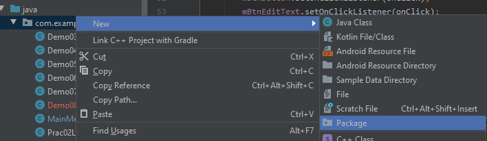
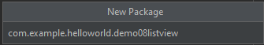
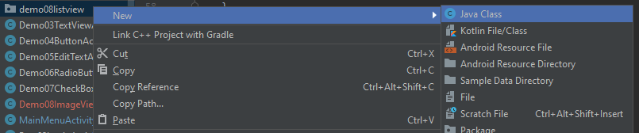
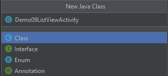
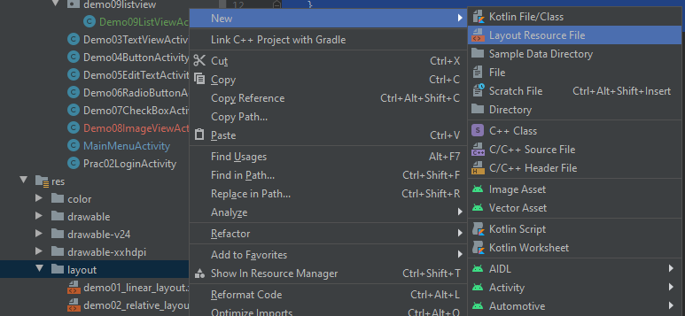
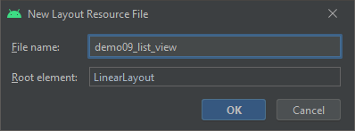

# Android Studio 操作指南（AS4.0+）

## 创建新的Activity

在`app/src/main/java/包名`右键（在包名上），选择`New > Activity`选择需要创建的Activity。

弹窗中输入新的Activity名和页面布局xml文件名，点击`Finish`创建。

到`AndroidManifest.xml`文件去声明`<activity android:name=".Activity名"></activity>`（通常会默认生成）

## Activity的完整创建过程

*这边以`Demo09ListView`作为讲解*

1. 首先，在`app/src/main/java/com.example.helloworld`右键，`New > Package`
   
2. 输入包名，如：`com.example.helloworld.demo09listview`**注：约定俗成的包名都是全部小写**
   
3. 右键刚刚创建的包`demo09listview`，`New > Class`
   
4. 输入类名，名字随意，如：`Demo09ListViewActivity`**注：约定俗成的类名都是大驼峰命名法**
   
5. 打开刚刚创建的类`Demo09ListViewActivity`，这时候应该长这样：

```java
package com.example.helloworld.demo09listview;

public class Demo09ListViewActivity {
}
```

6. 在`public class Demo09ListViewActivity`之后加上：`extends Activity`（这时候通常会自动导包，没有的话自己加上去）
   `import android.app.Activity`：
   `Activity`就是最普通的（啥都没有的）界面（就连上边的SystemUI都不会显示）
   其他的Activity就自己谷歌或百度一下吧~（后续笔记可能会记录到，毕竟这玩意挺重要的）

```java
public class Demo09ListViewActivity extends Activity {
}
```

7. 在类里面输入`onCreate`这时候通常会有智能提示，回车之后就会出现如下（会自动导包）

   `import android.os.Bundle` 和 `import androidx.annotation.Nullable`
   **其实这就是Java的覆盖重写onCreate函数（onCreate是Android app的声明周期，后面的笔记会提到）**：

```java
public class Demo09ListViewActivity extends Activity {
    @Override
    protected void onCreate(@Nullable Bundle savedInstanceState) {
        super.onCreate(savedInstanceState);
    }
}
```

8. 到`app/src/main/res/layout`右键，`New > Layout Resource File`
   
9. 输入页面名，名字随意，如：`demo09_list_view`**约定俗成的布局名是全小写，单词之间用下划线间隔**
   下边`Root Element`可以输入所需要的页面布局（如：`LinearLayout`，`RelativeLayout`）
   
10. 回到Java文件`Demo09ListViewActivity.java`，在onCreate函数里输入`setContentView(R.layout.demo09_list_view);`
    `R`会自动导包`import com.example.helloworld.R`（`此项目的包名.R`）：

```java
public class Demo09ListViewActivity extends Activity {
    @Override
    protected void onCreate(@Nullable Bundle savedInstanceState) {
        super.onCreate(savedInstanceState);
        setContentView(R.layout.demo09_list_view);
    }
}
```

11. 在 `AndroidManifest.xml`里声明此Activity
    这边顺便分析一下：为什么是：`.demo09listview.Demo09ListViewActivity`

```xml
<manifest xmlns:android="http://schemas.android.com/apk/res/android"
    package="com.example.helloworld">
    <!--package声明了此引用的包名，而 Demo09ListViewActivity 包含于 com.example.helloworld的demo09listview 包下-->
    <!--所以定义的时候，就从package所声明包之后的包开始写：-->
    
    <application>
    	<activity android:name=".demo09listview.Demo09ListViewActivity"/>
	</application>
    
</manifest>
```